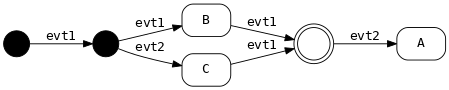

[](https://travis-ci.org/dsiroky/dsml)
[](https://ci.appveyor.com/project/dsiroky/dsml/branch/master)

# dsml - C++ state machine library

Motivation to create another SM library was to have well implemented anonymous
transitions and more straightforward approach to composite state machines.
*dsml* aims to be almost UML compliant.

## Main goals

* Header only.
* Lightning fast.
* Minimal resulting binary footprint and speed - don't pay for what you don't need.
* Safe - many compile-time checks.
* Clear semantics.
* State machine can be embedded into a custom class.
* Well tested.

## Table of contents

- [Requirements](#requirements)
- [Examples](#examples)
  * [Hello world](#hello-world)
  * [Transitions](#transitions)
  * [Guards](#guards)
    + [Combined](#combined)
  * [Actions](#actions)
    + [Multiaction](#multiaction)
  * [State entry/exit actions](#state-entry-exit-actions)
  * [Guards and actions together](#guards-and-actions-together)
  * [Handling unexpected events](#handling-unexpected-events)
  * [Generic source pseudostate](#generic-source-pseudostate)
  * [Dependencies](#dependencies)
    + [Passing data via events](#passing-data-via-events)
  * [Composite state machines](#composite-state-machines)
  * [Observer](#observer)
  * [Miscelaneous](#miscelaneous)
    + [Reset the state machine](#reset-the-state-machine)
    + [Exceptions](#exceptions)

## Requirements

- C++14 syntax
- few headers from STL

## Examples

### Hello world


If your compiler supports templated user-defined literals with string argument
(e.g. gcc and clang) then you can represent states with a custom literal with a
suffix `_s` and events with `_e`.

```cpp
#include <iostream>

#include <dsml.hpp>

static constexpr auto guard = [](){ return true; };
static constexpr auto action = [](){ std::cout << "hello\n"; };

struct MyMachine
{
  auto operator()() const noexcept
  {
    using namespace dsml::literals;

    return dsml::make_transition_table(
          dsml::initial_state + "evt1"_e = "A"_s
        , "A"_s + "evt2"_e = "B"_s
        , "A"_s + "evt3"_e [ guard ] = "C"_s
        , "B"_s + "evt4"_e / action = "C"_s
        , "B"_s + "evt1"_e = "B"_s
        , "C"_s = "D"_s
      );
  }
};

int main()
{
  using namespace dsml::literals;

  dsml::Sm<MyMachine> sm{};
  sm.process_event("evt1"_e);
  sm.process_event("evt2"_e);
  sm.process_event("evt4"_e);
  return sm.is("D"_s);
}
```

If you prefer identifiers (which makes the code less prone to typos) or you
can't use those fancy user literals (e.g. MSVC) then use this notation:

```cpp
#include <iostream>

#include <dsml.hpp>

static constexpr auto guard = [](){ return true; };
static constexpr auto action = [](){ std::cout << "hello\n"; };

#define STATE(x) static constexpr auto x = dsml::State<struct x##_>{}
STATE(A);
STATE(B);
STATE(C);
STATE(D);

#define EVENT(x) static constexpr auto x = dsml::Event<struct x##_>{}
EVENT(evt1);
EVENT(evt2);
EVENT(evt3);
EVENT(evt4);

struct MyMachine
{
  auto operator()() const noexcept
  {
    return dsml::make_transition_table(
          dsml::initial_state + evt1 = A
        , A + evt2 = B
        , A + evt3 [ guard ] = C
        , B + evt4 / action = C
        , B + evt1 = B
        , C = D
      );
  }
};

int main()
{
  dsml::Sm<MyMachine> sm{};
  sm.process_event(evt1);
  sm.process_event(evt2);
  sm.process_event(evt4);
  return sm.is(D);
}
```

### Transitions


```cpp
// anonymous
"A"_s = "B"_s
```


```cpp
// with event
"A"_s + "evt1"_e = "B"_s
```

### Guards

```cpp
const auto guard = [](){ return true; };
```

```cpp
// anonymous transition
"A"_s [ guard ] = "B"_s
```

```cpp
// with event
"A"_s + "evt1"_e [ guard ] = "B"_s
```

#### Combined
You can combine guards into a logical expression:
```cpp
// add this into your scope to enable guard logical expressions
using dsml::operators;
```

```cpp
// with event
"A"_s + "evt1"_e [ guard1 && guard2 || !guard3 ] = "B"_s
```

### Actions

```cpp
const auto action = [](){ do_something(); };
```

```cpp
// anonymous transition
"A"_s / action = "B"_s
```

```cpp
// with event
"A"_s + "evt1"_e / action = "B"_s
```

**Beware:** If you call `process_event()` inside the action then you will
get undefined behaviour because the action is called "in between" states.

#### Multiaction

You can chain multiple actions together. First you have to "include" operators:

```cpp
// add this into your scope to enable actions chaining
using dsml::operators;
```

Then you can chain actions separated with commas. Parentheses must be around the
group.

```cpp
"A"_s + "evt1"_e / (action1, action2, action3) = "B"_s
```

### State entry/exit actions

```cpp
const auto action = [](){ do_something(); };
```

```cpp
"A"_s + dsml::on_entry / action,
"A"_s + dsml::on_exit / action
```

Processing an event leading to the same state will invoke exit/entry actions
too. E.g. :

```cpp
"A"_s + dsml::on_entry / action_entry,
"A"_s + dsml::on_exit / action_exit,
"A"_s + "evt1"_e = "A"_s
```

Calling `process_event("evt1"_e)` in the state *A* will call `action_exit()`
and `action_entry()`.

### Guards and actions together

```cpp
const auto guard = [](){ return true; };
const auto action = [](){ do_something(); };
```

```cpp
// anonymous transition
"A"_s [ guard ] / action = "B"_s
```

```cpp
// with event
"A"_s + "evt1"_e [ guard ] / action = "B"_s
```

### Handling unexpected events

```cpp
  "A"_s + "evt1"_e = "B"_s
, "A"_s + "evt2"_e = "C"_s
, "A"_s + dsml::unexpected_event = "D"_s
```

Calling `process_event` function with any event other than `"evt1"_e` or
`"evt2"_e` will transition to state `D`. Unexpected event has lower priority.

### Generic source pseudostate

If you have an event that leads to the same state from every other state then
use `any_state`. You can combine it with `unexpected_event`:

```cpp
  "A"_s + "evt1"_e = "B"_s
, dsml::any_state + "evt1"_e = "C"_s // lower priority
, dsml::any_state + dsml::unexpected_event = "D"_s // lowest priority
```

### Dependencies

Useful to connect the SM with non-global logic. You can use lambdas (or free
functions) that will accept dependencies as arguments or you can pass
member function pointers.

Use `dsml::callee()` to wrap member function pointers.

```cpp
struct Logic
{
  int x{};

  bool dguard() const
  {
    return x < 99;
  }

  void daction(int& num)
  {
    x = 33;
    num += 3;
  }
};

const auto guard = [](const Logic& logic){ return logic.x <= 5; };
const auto action = [](Logic& logic, int& num){ logic.x += 2; num += 10; };

struct MyMachine
{
  auto operator()() const noexcept
  {
    using dsml::callee;
    using namespace dsml::literals;
    using namespace dsml::operators;

    return dsml::make_transition_table(
          dsml::initial_state + "evt1"_e [ guard ] / action = "A"_s
        , dsml::initial_state + "evt1"_e [ ! guard ] = "B"_s
        , dsml::initial_state
                + "evt1"_e [ callee(&Logic::dguard) ] / callee(&Logic::daction)
                = "B"_s
      );
  }
};

void func()
{
  using namespace dsml::literals;

  Logic logic{};
  int num{};
  // Internally it will create Logic& and int& references.
  dsml::Sm<MyMachine, Logic, int> sm{logic, num};
  sm.process_event("evt1"_e);
  std::cout << num << '\n';
}
```

#### Passing data via events

If your event base type is a complete type then you can also pass a value of
that type to the state machine. E.g.:

```cpp
// Base type is "int".
static constexpr auto evt = dsml::Event<int>{};

// Guard will accept value of "int".
const auto guard = [](int x){ return x <= 5; };

struct MyMachine
{
  auto operator()() const noexcept
  {
    using namespace dsml::literals;
    using namespace dsml::operators;

    return dsml::make_transition_table(
          dsml::initial_state + evt [ guard ] = "A"_s
        , dsml::initial_state + evt [ ! guard ] = "B"_s
      );
  }
};

void func()
{
  dsml::Sm<MyMachine> sm{};
  // Value 3 will be passed to the guard/action.
  // The event has an call operator which will accept that value.
  sm.process_event(evt(3));
}
```

### Composite state machines


```cpp
struct OtherMachine
{
  auto operator()() const noexcept
  {
    return dsml::make_transition_table(
          dsml::initial_state + "evt1"_e = "B"_s
        , dsml::initial_state + "evt2"_e = "C"_s
        , "B"_s + "evt1"_e = dsml::final_state
        , "C"_s + "evt1"_e = dsml::final_state
      );
  }
};

struct CompositeMachine
{
  auto operator()() const noexcept
  {
    return dsml::make_transition_table(
          dsml::initial_state + "evt1"_e = dsml::State<OtherMachine>{}
        , dsml::State<OtherMachine>{} + "evt2"_e = "A"_s
      );
  }
};
```

Internally the whole state machine is connected like this:



Transitions to the sub-machine are connected to its initial state and
transitions from the sub-machine are connected to its final state.

### Observer

Useful e.g. for logging.

```cpp
// must be inherited from dsml::Observer
struct MyObserver : dsml::Observer
{
  // methods are not virtual

  template <typename TEvent>
  void event()
  {
    std::cout << "event: " << TEvent::c_str() << '\n';
  }

  template <typename TGuard>
  void guard(const TGuard&, const bool result)
  {
    std::cout << "guard " << result << '\n';
  }

  template <typename TAction>
  void action(const TAction&)
  {
    std::cout << "action\n";
  }

  template <typename TSrcState, typename TDstState>
  void state_change()
  {
    std::cout << TSrcState::c_str()
              << " -> "
              << TDstState::c_str()
              << '\n';
  }
};

struct MyMachine
{
  auto operator()() const noexcept
  {
    using namespace dsml::literals;

    const auto guard = [](){ return true; };
    const auto action = [](){ std::cout << "hello\n"; };

    return dsml::make_transition_table(
          dsml::initial_state + "evt"_e [ guard ] / action = "A"_s
      );
  }
};

void func()
{
  using namespace dsml::literals;

  MyObserver observer{};
  dsml::Sm<MyMachine, MyObserver> sm{observer};
  sm.process_event("evt"_e);
}
```

### Miscelaneous

#### Reset the state machine

```cpp
dsml::Sm<MyMachine> sm{};
sm.process_event("evt"_e);
sm.reset();
assert(sm.is(dsml::initial_state));
```

#### Exceptions

If an action or a guard throws an exception then the library calls
`std::abort()`. State machines don't have exceptions. You have to model it e.g.
with an extra state performing the action and outgoing anonymous transitions with
guards checking if the action failed or not.


```cpp
return dsml::make_transition_table(
      dsml::initial_state + "evt"_e = "decision"_s
    , "decision"_s [ is_ok ] = "B"_s
    , "decision"_s [ ! is_ok ] = "C"_s
  );
```
